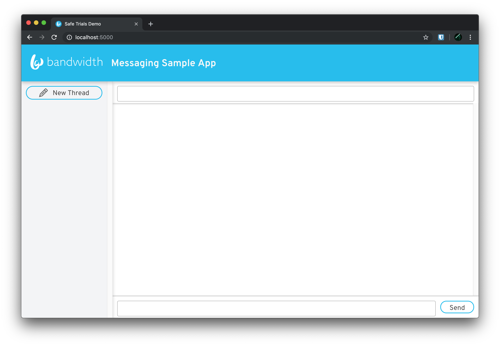

# Pushpay fork changes

1. The API url used by default is `https://api.catapult.inetwork.com/`. Change it to `https://messaging.bandwidth.com/api` instead.
2. Change some environment variable names to be more relevant.
3. Remove the `applicationId` from the message payload before writing it to the database.
4. Remove annoying automatic prefixing of "+1" with phone numbers.
5. Update client to have a separate text input for the `From` number.
6. Update server to work with multiple `From` numbers.

# Bandwidth Messaging API Sample App

This app demonstrates how you can build a small server that works with Bandwidth's Messaging API. It will send and receive messages, store them and retrieve them, provide conversation threading, and provide a web interface that updates in realtime.


## Prerequisites

To use this sample, you will need a Messaging-enabled Bandwidth Account, and a MariaDB database to store your messages. This guide assumes that you already have MariaDB set up, and an empty schema called `messaging` created for use with this app. You will also need Node.js installed to run this sample.

## Setup

Download the source code:

    $ git clone https://github.com/BandwidthExamples/messaging-sample-app.git
    $ cd messaging-sample-app

### Set environment variables

You will need to fill in the appropriate values for your database connection, and API credentials in the `.env` file in the root of the project directory.

```
PORT=5000
USERNAME=messaging
DATABASE_HOST=127.0.0.1
DATABASE_PORT=3306
DATABASE_USERNAME=root
DATABASE_PASSWORD=
DATABASE_NAME=messaging

BANDWIDTH_ACCOUNT_ID=
BANDWIDTH_API_TOKEN=
BANDWIDTH_API_SECRET=

APPLICATION_ID=
APPLICATION_FROM_NUMBERS=<'from' phone numbers>
```

### Start MariaDB database

Start the `docker-compose` stack in [`pony-formation/docker/my-little-phoney/docker-compose.local.yml`](https://github.com/pushpay/pony-formation/blob/master/docker/my-little-phoney/docker-compose.mariadb.yml). This will start a MariaDB service on port 3306.

### Install Node.js dependencies

    $ npm run install:all

### Build the client app

    $ cd client
    $ npm build

### Build and run the server

    $ cd ..
    $ npm start
    Server listening on port 5000

### Start messaging!

Open a web browser and point it to `http://localhost:5000`
